# DataSearcher


> Загрузи таблицу или подключись к БД. Задай вопрос на русском.  
> Получи ответ с графиками, инсайтами, прогнозами и публичными дашбордами.
>
> **Спойлер:** работает даже на дешёвых моделях вроде Deepseek V4 Flash.
> Не нужны GPT-5 и Claude Opus — нужен правильный системный промпт
> и качественный набор инструментов.

---

## Откуда задача

Я анализирую данные каждый день. Excel — медленно. Python — порог входа.
BI-системы — оверкилл для быстрого вопроса «сколько клиентов ушли в прошлом
квартале и почему».

Хотелось инструмента, который понимает вопросы на русском, сам пишет SQL,
строит графики, находит аномалии и прогнозирует тренды. Без настройки.
Без дашбордов из 20 виджетов. Просто — загрузил файл или подключился к БД и спросил.

DataSearcher — это попытка сделать аналитику данных разговорной.

Не «напиши SQL», а «какие факторы сильнее всего влияют на отток».  
Не «построй график», а «покажи тренд продаж с прогнозом на 3 месяца».  
Не «настрой Tableau», а «опубликуй дашборд для команды».

---

## С чего начинается работа

Открыл приложение — увидел два пути: перетащить Excel/CSV или подключиться
к существующей БД. Никаких настроек до первой пользы.

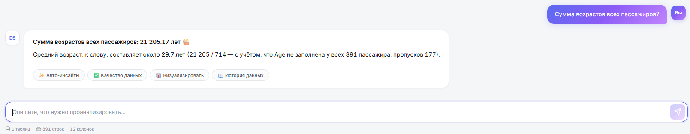

Поддерживаются PostgreSQL, MySQL, ClickHouse, SQLite. Файлы — XLSX и CSV
любого размера в пределах памяти DuckDB.

После загрузки сразу появляются **6 шаблонов анализа** — для тех, кто
не хочет формулировать вопрос с нуля:

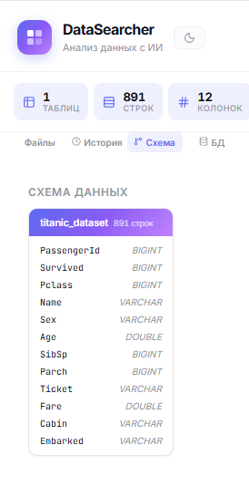

Обзор данных, аудит качества, корреляции, дашборд, тренды, история данных.
Один клик — и инструмент сам начинает копать.

---

## Почему не существующие инструменты

| Инструмент | Что умеет | Почему не подходит |
|-----------|-----------|-------------------|
| Excel | Всё | Медленно, нет ML, не прогнозирует, не публикует |
| Python + Jupyter | Всё | Порог входа, не разговорный |
| Tableau / Power BI | Дашборды | Оверкилл для разовых вопросов, дорого |
| ChatGPT с CSV | Чат | Без SQL, без интерактивных таблиц, без БД |
| Code Interpreter | Анализ файлов | Нельзя подключить prod БД, нет ролей и публичных ссылок |

DataSearcher отвечает на конкретный вопрос: **как задать вопрос данным
голосом продакта, а не голосом аналитика — и получить ответ
в виде графиков, таблиц, инсайтов и готовых дашбордов, а не кода.**

---

## Как это устроено

```
┌──────────┐     ┌──────────┐     ┌──────────┐
│  React   │────▶│ FastAPI  │────▶│  DuckDB  │
│  Chat UI │◀────│  + LLM   │◀────│ In-mem   │
└──────────┘ SSE └──────────┘     └──────────┘
                  │                      ▲
                  ▸ 30 analysis tools    │
                  ▸ SSE streaming        │
                  ▸ JWT auth             │
                  ▸ Public dashboards    │
                  ▸ Admin panel          │
                                         │
                  ┌──────────────────────┘
                  │ PostgreSQL, MySQL, ClickHouse, SQLite
                  └── Connect to existing databases
```

1. Пользователь загружает файл или подключается к БД
2. Задаёт вопрос на русском
3. LLM выбирает нужные инструменты из 30 доступных, выполняет SQL, строит графики
4. Результат стримится в чат через SSE с интерактивными таблицами и чартами
5. По запросу — публикует дашборд с уникальной ссылкой для команды

---

## 30 инструментов анализа

Это не список фич ради списка — это каркас, на котором LLM собирает ответы.
Для продакта важно понимать одно: **модель не пишет код руками каждый раз.**
Она вызывает готовые проверенные функции, что делает результаты воспроизводимыми
и работает даже на слабых моделях.

| # | Инструмент | Описание |
|---|-----------|----------|
| 1 | `sql_query` | Прямые SQL-запросы к DuckDB |
| 2 | `profile_data` | Детальная статистика по колонкам |
| 3 | `smart_summary` | Умное описание структуры данных |
| 4 | `data_quality_report` | Аудит качества (пропуски, дубликаты) |
| 5 | `find_duplicates` | Поиск дубликатов (точных и fuzzy) |
| 6 | `detect_anomalies` | Выбросы и нетипичные значения |
| 7 | `sample_data` | Быстрый просмотр данных |
| 8 | `correlation_analysis` | Корреляции между переменными |
| 9 | `distribution_analysis` | Форма распределения (нормальное, скошенное) |
| 10 | `cross_tab` | Кросс-табуляция двух категорий |
| 11 | `pivot_table` | Сводная таблица в стиле Excel |
| 12 | `segment_data` | Сегментация (квинтили, RFM) |
| 13 | `compare_tables` | Сравнение двух таблиц |
| 14 | `time_analysis` | Тренды, сезонность, динамика |
| 15 | `auto_insights` | Авто-поиск топ-5 инсайтов |
| 16 | `generate_sql` | Генерация SQL из описания |
| 17 | `visualize_data` | Графики (bar, line, pie, scatter, area, histogram) |
| 18 | `predict_trend` | Прогноз тренда на будущее |
| 19 | `cluster_analysis` | Кластеризация (K-Means, DBSCAN) |
| 20 | `feature_importance` | Важность факторов для целевой переменной |
| 21 | `statistical_test` | t-тест, KS-тест, Хи-квадрат |
| 22 | `classify_rows` | Классификация строк через LLM |
| 23 | `transform_data` | Преобразования (нормализация, one-hot, даты) |
| 24 | `merge_tables` | JOIN двух таблиц |
| 25 | `export_data` | Экспорт в CSV |
| 26 | `detect_patterns` | Паттерны в тексте (email, ИНН, телефон) |
| 27 | `build_dashboard` | Дашборд из 4-6 графиков в чате |
| 28 | `data_story` | Нарратив с графиками |
| 29 | `get_schema` | Визуальная структура таблицы |
| 30 | **`create_public_dashboard`** | **Публичный дашборд с фильтрами и ссылкой** |

---

## Как это работает на практике

Покажу на классическом датасете «Титаник» (891 строка, 12 колонок) — что именно
происходит после загрузки файла.

### 1. Понимание структуры данных

Сразу после загрузки в боковой панели появляется схема таблицы с типами колонок.
Без запроса, автоматически.

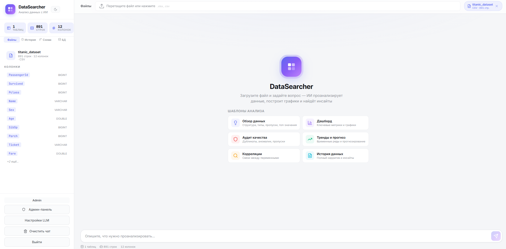

### 2. Простой вопрос — простой ответ

«Сумма возрастов всех пассажиров?» — система не просто считает сумму,
а сама добавляет контекст: средний возраст, количество пропусков, рекомендации
что делать дальше.

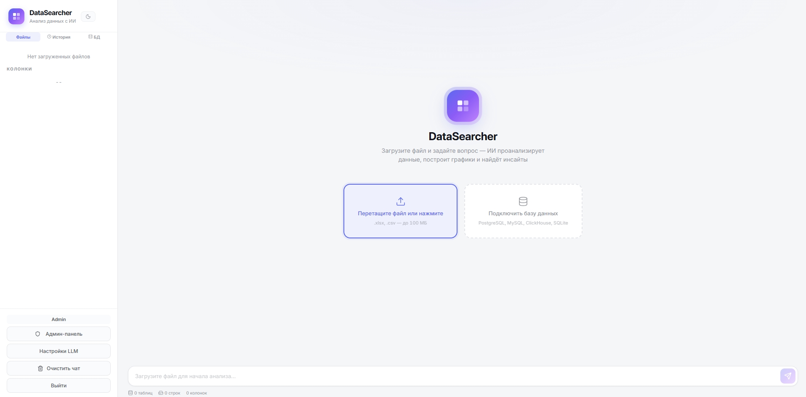

Под ответом — кнопки быстрых действий: «Авто-инсайты», «Качество данных»,
«Визуализировать», «История данных». Это снимает ступор «а что спросить дальше».

### 3. Просмотр сырых данных в один клик

Иногда нужно просто посмотреть на исходники, чтобы понять что вообще пришло.
Модальное окно с интерактивной таблицей — сортировка, поиск, пагинация,
подсветка NULL.

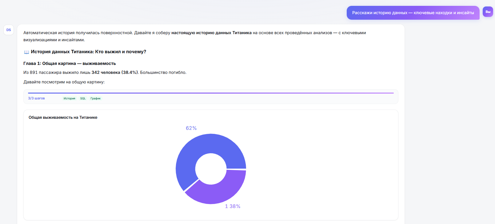

### 4. Аудит качества

«Проверь качество данных» — получаешь оценку по 100-балльной шкале,
разбивку по типам проблем и конкретные рекомендации что чинить.

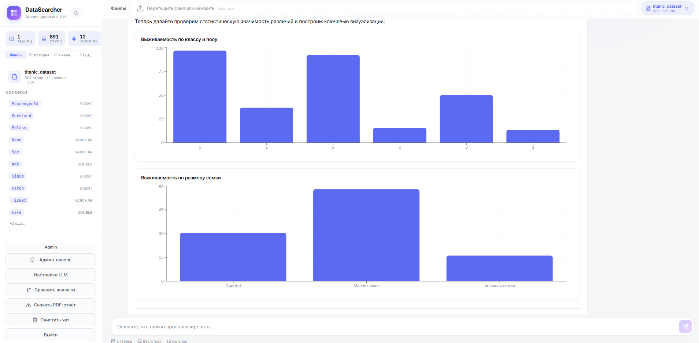

В колонке Cabin 77% пропусков → инструмент сам говорит: «удалить или обработать».
В Age 19.9% → «заполнить медианой». Это не «вот цифры, разбирайся» —
это готовое решение.

### 5. Дашборды и корреляции

«Покажи дашборд» — собирается сводка из ключевых метрик и таблица корреляций.
Без настройки виджетов, без drag-and-drop.

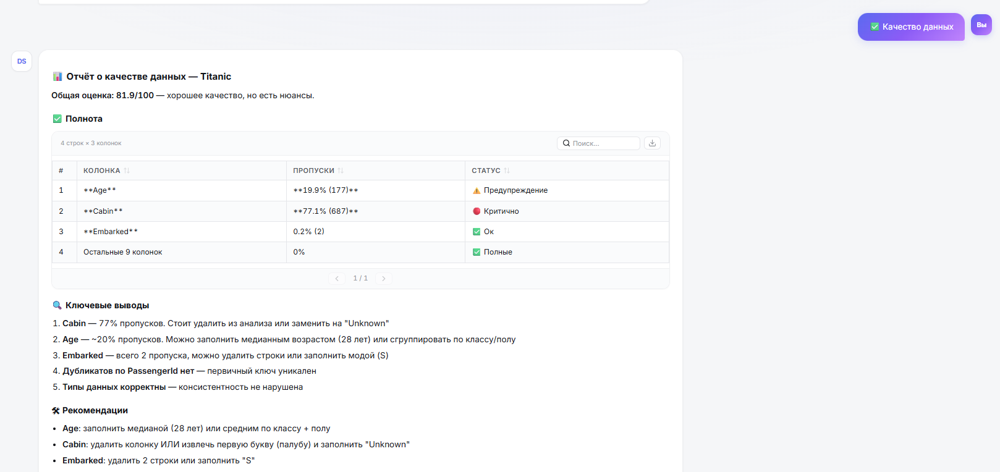

### 6. Сложные визуализации

«Сравни выживаемость по классу и полу» — две связанные диаграммы,
автоматически выбран правильный тип графика под тип сравнения.

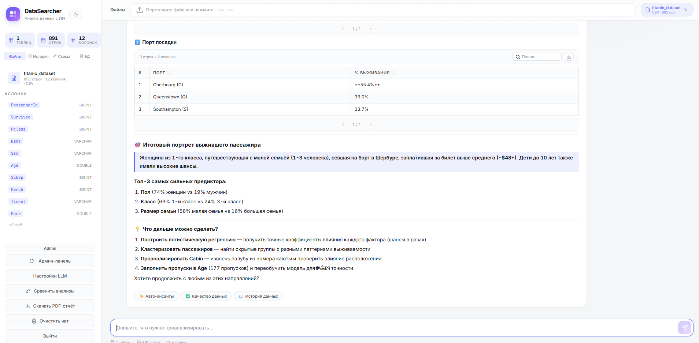

### 7. История данных (storytelling)

Самая мощная функция для презентаций. «Расскажи историю данных» —
инструмент генерирует **нарратив главами**, с заголовками, выводами и графиками.
Получается готовая презентация в чате.

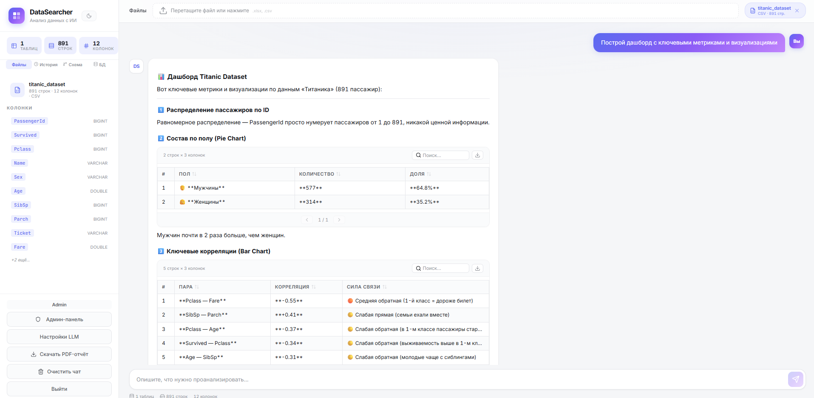

### 8. Финальные инсайты и портрет

«Кто выжил и почему» — портрет идеального выжившего, топ-3 предиктора
с конкретными процентами, рекомендации по дальнейшему ML.

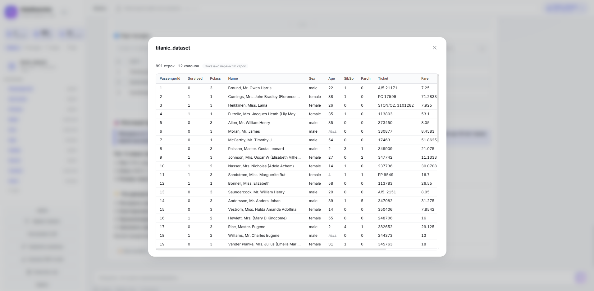

Это уже не «LLM ответил». Это законченный аналитический отчёт,
который можно отдать заказчику.

---

## Публичные дашборды

Финальный шаг любого анализа — поделиться результатом. Обычно это значит
«сделать скриншоты, вставить в презентацию, отправить почтой». DataSearcher
закрывает этот шаг одной фразой в чате.

> «Создай публичный дашборд по продажам»

LLM вызывает `create_public_dashboard`, который сам определяет структуру
данных, автоматически собирает фильтры, KPI и графики — и отдаёт **уникальную
публичную ссылку вида** `/d/aB3xKp9m`. Её можно отправить руководителю,
клиенту или вставить в Notion. Без авторизации, без VPN, без объяснений.

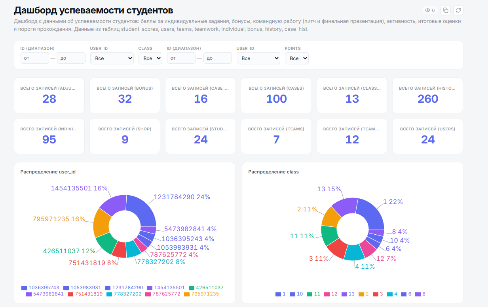

### Как это работает под капотом

1. **Снапшот данных** — все загруженные таблицы копируются в CSV на момент
   создания. Дашборд не зависит от сессии и не сломается, если ты удалишь файл.
2. **Определение типов** — DuckDB `DESCRIBE` анализирует колонки.
3. **Автогенерация фильтров, KPI и графиков** на основе структуры.
4. **Уникальная ссылка** + опционально пароль.

### Автоматические фильтры

Самое полезное — фильтры подбираются по логике, а не по типу колонки в схеме.
Числовое поле `grade` с пятью уникальными значениями — это категория, а не
диапазон. DataSearcher это понимает:

| Тип данных | Условие | Тип фильтра |
|------------|---------|-------------|
| Текстовая колонка | >1 уникального значения | Выпадающий список |
| Числовая | ≤20 уникальных и <80% строк | Выпадающий список (категория) |
| Числовая | >20 уникальных | Слайдер диапазона |
| Дата/время | — | Выбор периода |

### Что внутри дашборда

**Фильтры (до 6 штук)** — применяются только к тем блокам, которые
используют соответствующие таблицы.

**KPI-карточки** — количество записей, средние значения числовых колонок
(ID-колонки автоматически исключаются).

**Графики** — подбираются по типу данных:
- **Bar** — среднее значение по категориям
- **Pie** — распределение категорий
- **Scatter** — корреляция двух числовых колонок
- **Line** — тренд по дате

### Безопасность и управление

- **Публичная ссылка** работает без авторизации
- **Пароль** — опционально, задаётся при создании
- **Снапшот вместо живого подключения** — данные не утекают из БД
- **Управление** — список всех дашбордов в sidebar с количеством просмотров,
  удаление одной кнопкой

Для продакта это значит одно: **анализ → дашборд → ссылка** — три шага
вместо «выгрузить в Excel, переделать в PowerBI, опубликовать, настроить
доступы».

---

## Что показало использование

Несколько паттернов после десятков прогонов на разных датасетах:

**Дешёвая модель + хорошие инструменты ≥ дорогая модель без инструментов.**
DataSearcher отлично работает на Deepseek V4 Flash — потому что LLM здесь
не вычисляет, а **выбирает** инструмент и интерпретирует результат.
Тяжёлые задачи делает DuckDB и scikit-learn, не модель.

**Шаблоны анализа важнее, чем кажется.** Большинство пользователей не знают
с чего начать. Шесть кнопок «Обзор / Качество / Корреляции / Дашборд / Тренды
/ Стори» решают эту проблему лучше, чем любой онбординг.

**Storytelling и портрет — главный wow-эффект.** Просто SQL-ответы выглядят
как Excel. История данных в виде глав с выводами — выглядит как работа аналитика.

**Публичные дашборды убирают последнюю ступеньку.** Раньше анализ заканчивался
скриншотом. Теперь — ссылкой. Это меняет ощущение продукта: не «инструмент
аналитика», а «инструмент работы с данными в команде».

> Качество системного промпта я проверял на собственном бенчмарке —
> [OfficeIQ Bench](https://github.com/MarkIvor/officeiq-bench).
> Это позволило подобрать формулировки, которые стабильно работают
> даже на бюджетных моделях.

---

## Возможности UI

**Работа с данными**
- Интерактивные таблицы — сортировка, поиск, пагинация, экспорт CSV, подсветка NULL
- ER-схема — визуальная структура таблиц и колонок
- Подключения к БД — PostgreSQL, MySQL, ClickHouse, SQLite на главном экране
- Авто-профиль и дашборд при загрузке первого файла

**Чат и интерфейс**
- Тёмная тема с переключением Ctrl+D
- Звуковые и Web-уведомления при завершении стрима
- Горячие клавиши: Ctrl+D тема, Ctrl+K фокус, Ctrl+Shift+P PDF
- История запросов в sidebar — клик повторяет анализ
- Умные подсказки на основе типов колонок (date → тренд, num → корреляция)
- Сравнение анализов в split-view

**Публикация**
- Публичные дашборды с уникальной ссылкой и опциональным паролем
- PNG графиков с 2x pixel ratio
- PDF-отчёты с титульной страницей и встроенными графиками
- CSV выгрузка любых таблиц

---

## Авторизация и роли

| Роль | Возможности |
|------|------------|
| **admin** | Управление пользователями, настройками, подключениями к БД, LLM-параметрами (глобальными и индивидуальными) |
| **analyst** | Загрузка файлов, анализ, публикация дашбордов, свои LLM-настройки (если разрешено), свои подключения к БД |
| **viewer** | Просмотр данных и результатов анализа |

### Admin-панель

Три вкладки:

**Пользователи** — список с бейджами роли и ограничений. Клик открывает
карточку с тремя секциями:
- **Права** — индивидуальные переключатели `can_use_custom_llm` / `can_use_db_connections`
- **LLM** — индивидуальные настройки URL/Model/API Key (пустые = глобальные)
- **БД** — список подключений пользователя + кнопка добавления

**Настройки** — глобальные переключатели:
- Регистрация пользователей (вкл/выкл)
- Пользовательские LLM-настройки (вкл/выкл)
- Пользовательские подключения к БД (вкл/выкл)
- Глобальные LLM-параметры (URL, Model, API Key)

**Базы данных** — CRUD подключений, тест соединения, attach к текущей сессии.

---

## Быстрый старт

### Требования

- Python 3.12+
- Node.js 20+
- LLM API (Ollama, vLLM, OpenAI-compatible)

### Установка

```bash
# Backend
cd backend
cp .env.example .env
# Отредактируй .env — укажи LLM URL и сгенерируй JWT_SECRET
pip install -r requirements.txt
python -m uvicorn app.main:app --host 0.0.0.0 --port 8000

# Frontend
cd frontend
npm install
npm run dev
```

### Первый вход

По умолчанию создаётся администратор:
- **Email:** `admin@datasearcher.com`
- **Пароль:** `admin`

Смени пароль после первого входа через админ-панель.

### Docker

```bash
docker-compose up -d
```

---

## Переменные окружения

| Переменная | По умолчанию | Описание |
|-----------|-------------|----------|
| `LLM_BASE_URL` | `http://localhost:11434/v1` | URL LLM API (OpenAI-compatible) |
| `LLM_API_KEY` | — | API-ключ для LLM |
| `LLM_MODEL` | `qwen2.5:14b` | Модель LLM |
| `JWT_SECRET` | _auto-generated_ | Секрет для JWT (ОБЯЗАТЕЛЬНО задать в prod) |
| `ENCRYPTION_KEY` | — | Fernet-ключ для шифрования connection strings |
| `ADMIN_EMAIL` | `admin@datasearcher.com` | Email администратора по умолчанию |
| `ADMIN_PASSWORD` | `admin` | Пароль администратора |
| `UPLOAD_DIR` | `./uploads` | Директория для загрузок |
| `DUCKDB_MEMORY_LIMIT` | `2GB` | Лимит памяти DuckDB |

> **Безопасность.** В продакшене обязательно задай `JWT_SECRET` и `ENCRYPTION_KEY`.  
> Сгенерировать:  
> `python -c "import secrets; print(secrets.token_hex(32))"` — для JWT_SECRET  
> `python -c "from cryptography.fernet import Fernet; print(Fernet.generate_key().decode())"` — для ENCRYPTION_KEY

---

## FAQ

**Какая минимальная модель подходит?**  
Стабильно работает на Qwen 2.5 14B локально и на Deepseek V4 Flash через API.
GPT-4 / Claude Sonnet дают чуть более красивые формулировки в storytelling,
но не меняют корректность анализа — основная работа делается DuckDB и scikit-learn.

**Можно ли использовать на конфиденциальных данных?**  
Да, если поднять локальную LLM (Ollama / vLLM) и не передавать данные наружу.
Connection strings шифруются Fernet-ключом, пароли пользователей — bcrypt.

**А публичные дашборды утекают данные?**  
Нет. Дашборд работает на снапшоте — CSV копии данных на момент создания.
Если нужна приватность, добавь пароль при создании. Можешь и удалить дашборд
в любой момент через sidebar.

**Какой максимальный размер файла?**  
Ограничен памятью DuckDB (`DUCKDB_MEMORY_LIMIT`, по умолчанию 2GB).
На практике файлы до 1-2 миллионов строк обрабатываются комфортно.

**Что если запрос требует SQL, который LLM не знает написать?**  
Инструмент `generate_sql` отдельно от `sql_query` — модель сначала описывает
намерение, потом валидирует SQL, потом исполняет. Если падает — есть retry
с уточнением через ошибку.

**Подключается ли к prod БД безопасно?**  
Через read-only роль на стороне БД — рекомендуемый путь. Сами connection
strings шифруются Fernet перед сохранением, доступны только владельцу
и админу.

**Поддерживается ли multi-turn?**  
Да. Контекст разговора передаётся в LLM, история запросов сохраняется
в localStorage и доступна по клику.

**Чем это лучше, чем просто загрузить CSV в ChatGPT?**  
Тремя вещами: реальный SQL-движок (DuckDB) вместо имитации, 30 готовых
инструментов вместо ad hoc кода, возможность подключиться к prod БД
и опубликовать дашборд по ссылке.

**Можно ли использовать в команде?**  
Да. Есть JWT-авторизация, три роли, индивидуальные настройки LLM
и подключений на пользователя. Админ может выдавать доступ к конкретным БД
конкретным аналитикам.

---

## Архитектура проекта

```
backend/
  app/
    main.py              # FastAPI, lifespan, routers
    config.py            # pydantic-settings
    session.py           # SessionManager, DuckDB connections
    models/
      __init__.py        # Pydantic models
      database.py        # SQLAlchemy models (User, AppSettings, UserSettings, DBConnection)
    routers/
      auth.py            # JWT auth (login/register/refresh/logout)
      admin.py           # Admin panel API (users, per-user LLM/connections)
      chat.py            # SSE chat + PDF export
      files.py           # File upload/list/delete/preview
      connections.py     # DB connections CRUD + attach
      dashboards.py      # Public dashboards CRUD + viewer
      settings.py        # LLM settings
    services/
      auth_service.py    # JWT, bcrypt, encryption, per-user LLM
      llm_service.py     # LLM streaming, tool loop
      pdf_export.py      # PDF generation with charts
      dashboard_service.py # Public dashboard generation
    prompts/
      system.py          # System prompt builder
    services/tools/      # 30 analysis tools

frontend/
  src/
    api/client.ts        # API client (auth, admin, connections, chat, PDF, dashboards)
    hooks/
      useAuth.tsx        # Auth context + provider
      useChat.ts         # Chat with progress tracking
      useFiles.ts        # File upload with auto-profile
      useTheme.ts        # Dark/light theme
      useNotification.ts # Sound + Web Notification
      useKeyboardShortcuts.ts
      useQueryHistory.ts # Query history in localStorage
    components/
      Chat/              # MessageBlocks, ChartBlock, InteractiveTable, AnalysisTemplates
      Layout/            # Sidebar, SchemaDiagram, SettingsModal, FilePreviewModal
      Admin/             # AdminPanel (with UserDetailModal)
      Dashboards/        # PublicDashboard viewer, DashboardList
      Files/             # FileUpload
      Pages/             # LoginPage, RegisterPage
```

---

## Технологии

| Слой | Технология |
|------|-----------|
| Frontend | React 19, TypeScript, Vite, Recharts, @tanstack/react-table |
| Backend | FastAPI, DuckDB, SQLAlchemy, JWT (PyJWT), bcrypt (passlib) |
| ML/Анализ | scikit-learn, scipy, numpy |
| DB Drivers | psycopg2 (PostgreSQL), pymysql (MySQL), clickhouse-connect, aiosqlite |
| PDF | fpdf2 со встроенными графиками PNG |
| Экспорт | html-to-image (PNG графиков) |

---

## License

MIT — используй, модифицируй, форкай.  
Ссылка на репозиторий приветствуется.
